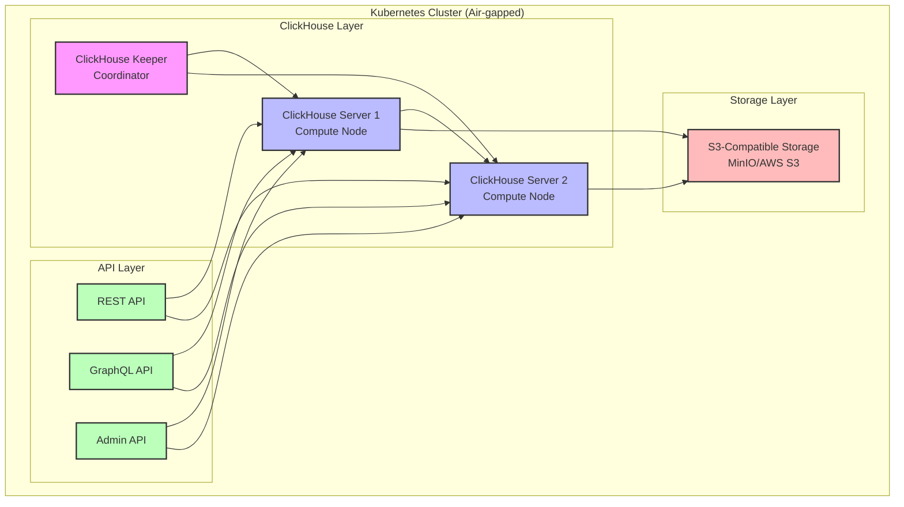
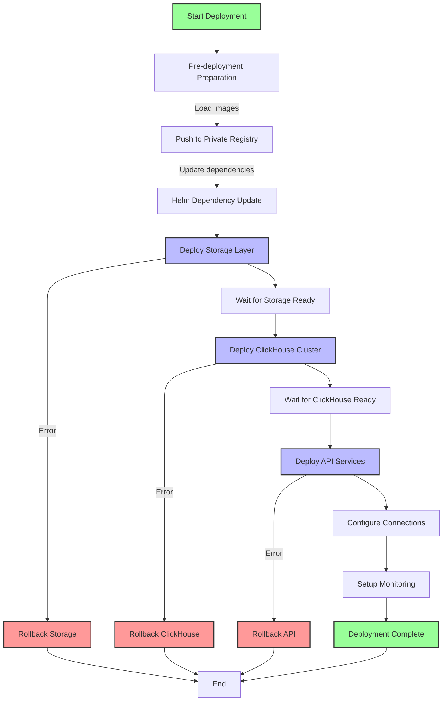
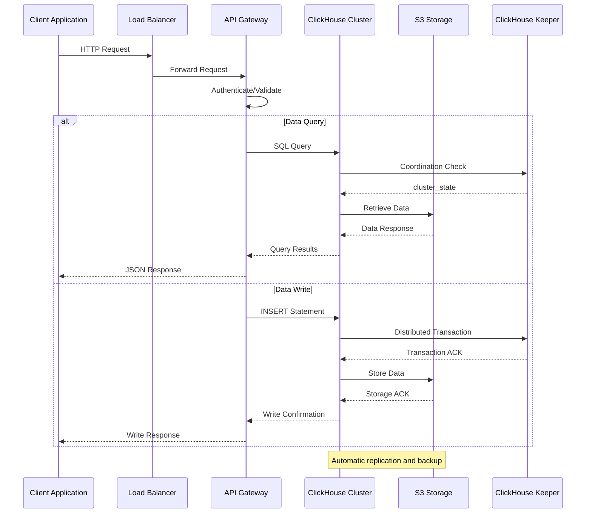
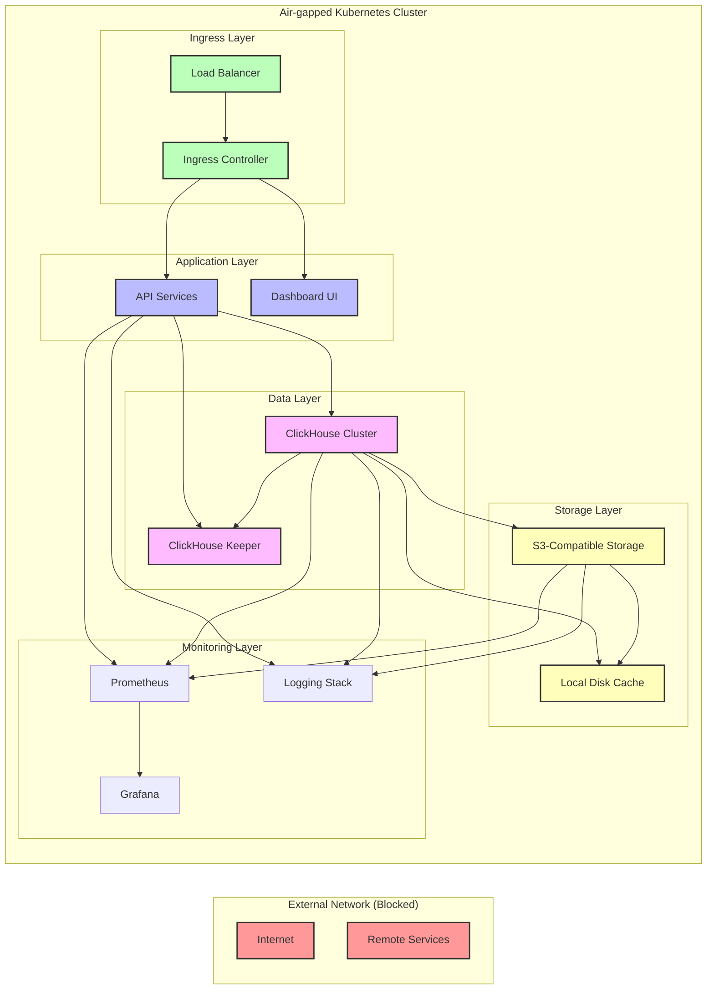
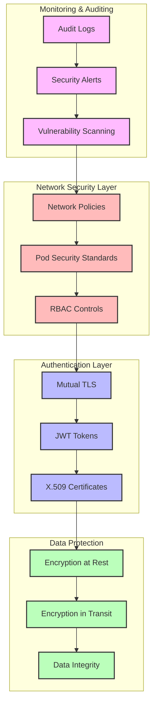

# ADR-001: Air-gapped ClickHouse Deployment with S3 Storage

## Status
Accepted

## Context
We need to deploy ClickHouse with compute nodes, API layer, and S3 storage integration in an air-gapped Kubernetes cluster. The deployment must handle:

- ClickHouse server cluster deployment
- API services for data interaction
- S3-compatible storage integration
- Air-gapped network constraints
- Helm chart-based deployment strategy

## Decision

### Architecture Overview



### Components

1. **ClickHouse Cluster**
   - ClickHouse Keeper (1 node): Zookeeper coordination
   - ClickHouse Servers (2+ nodes): Compute and storage nodes
   - Replica configuration for high availability

2. **API Layer**
   - REST API: Standard HTTP endpoints
   - GraphQL API: Flexible query interface
   - Admin API: Management and monitoring

3. **Storage Integration**
   - S3-compatible storage for persistent data
   - Local disk caching for performance
   - Backup and restore capabilities

### Air-gapped Strategy

#### 1. Image Management
```yaml
# Pre-load container images into private registry
images:
  clickhouse:
    repository: private-registry.local/clickhouse/clickhouse-server
    tag: "23.8.1.1234"
  keeper:
    repository: private-registry.local/clickhouse/clickhouse-keeper
    tag: "23.8.1.1234"
  api:
    repository: private-registry.local/custom/clickhouse-api
    tag: "1.0.0"
```

#### 2. Dependency Management
- Package all required dependencies in Docker images
- Use offline installation for system packages
- Bundle Java runtime and libraries

#### 3. Network Configuration
```yaml
# Internal service communication
networkPolicy:
  enabled: true
  ingress:
    - from:
        - namespaceSelector:
            matchLabels:
              name: clickhouse-system
      ports:
        - protocol: TCP
          port: 9000  # ClickHouse native protocol
        - protocol: TCP
          port: 8123  # ClickHouse HTTP
        - protocol: TCP
          port: 8080  # API services
```

## Helm Chart Deployment

### chart.yaml
```yaml
apiVersion: v2
name: clickhouse-airgapped
description: ClickHouse deployment for air-gapped environments
type: application
version: 1.0.0
appVersion: "23.8.1.1234"
dependencies:
  - name: clickhouse
    version: "3.3.0"
    repository: "file://charts/clickhouse"
  - name: minio
    version: "12.0.4"
    condition: minio.enabled
```

### Values Configuration
```yaml
# ClickHouse Configuration
clickhouse:
  replicas: 2
  keeper:
    replicas: 1
  configmap:
    storage_configuration:
      s3:
        type: s3
        endpoint: "http://minio-service:9000"
        access_key_id: "minioadmin"
        secret_access_key: "minioadmin"
        bucket: "clickhouse-data"
        path: "/data/"
    
    zookeeper:
      nodes:
        - host: clickhouse-keeper-0.clickhouse-keeper-headless.default.svc.cluster.local
          port: 2181

# API Services
api:
  rest:
    enabled: true
    replicaCount: 2
    service:
      port: 8080
      targetPort: 8080
  
  graphql:
    enabled: true
    replicaCount: 1
    service:
      port: 8081
      targetPort: 8081

# S3 Storage (MinIO for air-gapped)
minio:
  enabled: true
  mode: distributed
  replicas: 4
  persistence:
    size: 100Gi
  resources:
    requests:
      memory: 1Gi
      cpu: 500m
    limits:
      memory: 2Gi
      cpu: 1000m

# Network Policies
networkPolicy:
  enabled: true
  ingress:
    - from:
        - namespaceSelector:
            matchLabels:
              name: ingress-nginx
  egress:
    - to: []
      ports:
        - protocol: TCP
          port: 53
        - protocol: UDP
          port: 53

# Resources and Limits
resources:
  clickhouse:
    requests:
      memory: 4Gi
      cpu: 2000m
    limits:
      memory: 8Gi
      cpu: 4000m
  
  keeper:
    requests:
      memory: 2Gi
      cpu: 1000m
    limits:
      memory: 4Gi
      cpu: 2000m
```

### Service Definitions
```yaml
# ClickHouse Headless Service
apiVersion: v1
kind: Service
metadata:
  name: clickhouse-headless
spec:
  clusterIP: None
  selector:
    app: clickhouse
  ports:
    - name: http
      port: 8123
      targetPort: 8123
    - name: tcp
      port: 9000
      targetPort: 9000

# API Gateway Service
apiVersion: v1
kind: Service
metadata:
  name: clickhouse-api-gateway
spec:
  selector:
    app: clickhouse-api
  ports:
    - name: rest
      port: 8080
      targetPort: 8080
    - name: graphql
      port: 8081
      targetPort: 8081
  type: LoadBalancer
```

## Implementation Steps

### Deployment Flow



### Component Interaction Sequence



1. **Pre-deployment Preparation**
   ```bash
   # Load images into private registry
   docker load < clickhouse-airgapped-images.tar
   docker push private-registry.local/clickhouse/clickhouse-server:23.8.1.1234
   
   # Prepare Helm charts with local dependencies
   helm dependency update
   ```

2. **Deploy Infrastructure**
   ```bash
   # Deploy storage layer first
   helm install clickhouse-storage . --set minio.enabled=true
   
   # Wait for storage to be ready
   kubectl wait --for=condition=ready pod -l app=minio --timeout=300s
   
   # Deploy ClickHouse cluster
   helm install clickhouse-cluster . --set clickhouse.enabled=true
   ```

3. **API Deployment and Configuration**
   ```bash
   # Deploy API services
   helm install clickhouse-api . --set api.enabled=true
   
   # Configure connections to ClickHouse
   kubectl apply - - <<EOF
   apiVersion: v1
   kind: ConfigMap
   metadata:
     name: clickhouse-api-config
   data:
     database.yaml: |
       clickhouse:
         host: clickhouse-headless
         port: 9000
         database: default
         username: default
   EOF
   ```

### Network Data Flow



### Security Architecture



## Monitoring and Observability

```yaml
# Prometheus monitoring
monitoring:
  prometheus:
    enabled: true
    serviceMonitor:
      enabled: true
      interval: 30s
      targets:
        - clickhouse:9090
        - minio:9000

# Logging
logging:
  fluentd:
    enabled: true
    destinations:
      - name: elasticsearch
        host: elasticsearch.logging.svc.cluster.local
        port: 9200
```

## Security Considerations

1. **Network Isolation**: Strict network policies preventing external access
2. **Secret Management**: Use Kubernetes secrets for credentials
3. **RBAC**: Principle of least privilege for service accounts
4. **Image Scanning**: All images scanned before deployment

## Consequences

### Positive
- Complete air-gapped deployment capability
- High availability with ClickHouse clustering
- Scalable API layer for client access
- Persistent storage with S3 compatibility

### Negative
- Increased complexity in deployment and maintenance
- Higher resource requirements for air-gapped setup
- Limited external monitoring and logging integration
- Manual dependency management for updates

### Neutral
- Dependency on internal container registry
- Requires pre-planning for image and package management
- Limited ability to use external managed services

## Alternatives Considered

1. **Standard Cloud Deployment**: Not suitable due to air-gapped requirements
2. **Local File Storage Only**: Lacks durability and scalability benefits of S3
3. **Single Node Deployment**: Insufficient for production workloads
4. **External Managed Database**: Incompatible with air-gapped constraints

## Implementation Status

- [x] Architecture design completed
- [x] Helm chart structure defined
- [ ] Container images built and loaded
- [ ] Integration testing in air-gapped environment
- [ ] Performance and scalability validation
- [ ] Security audit and penetration testing

## References

- [ClickHouse Official Documentation](https://clickhouse.com/docs)
- [Kubernetes Air-Gapped Patterns](https://kubernetes.io/docs/setup/production-environment/tools/air-gapped/)
- [Helm Best Practices](https://helm.sh/docs/topics/best_practices/)
- [MinIO Operator Guide](https://min.io/docs/minio/kubernetes/upstream/index.html)
